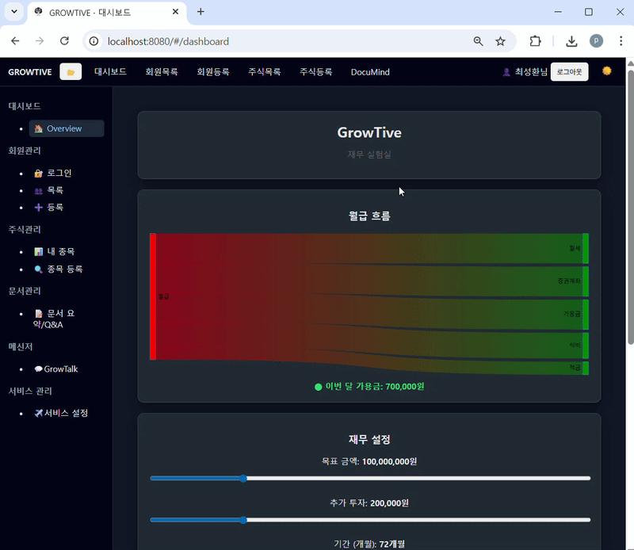

# GrowTive

AI 기반 개인 성장 플랫폼

GrowTive는 개인의 **재무 관리, 지식 관리, 커뮤니케이션**을 하나의 플랫폼에서 관리할 수 있도록 설계된 웹 애플리케이션입니다.

---

## Features

- 💰 Money Dashboard
- 📊 Financial Snapshot System
- 📁 Template-based Finance Structure
- 🔗 Sankey Salary Flow Visualization
- 💬 WebSocket Chat (GrowTalk)

---

## Tech Stack

### Backend
- Spring Boot
- MyBatis
- MariaDB

### Frontend
- Vanilla JS SPA
- Axios
- Chart.js

---

## Architecture
Page → Axios → Spring Controller → Service → MyBatis → MariaDB


---

## Project Structure

````
Directory structure:
└── choisunghwan-growtive/
    ├── README.md
    ├── gradlew
    ├── gradlew.bat
    ├── docs/
    │   └── db/
    │       ├── chat_schema.sql
    │       └── schema.md
    └── src/
        ├── main/
        │   ├── java/
        │   │   └── com/
        │   │       └── growtive/
        │   │           ├── GrowtiveApplication.java
        │   │           ├── auth/
        │   │           │   ├── controller/
        │   │           │   │   ├── AuthController.java
        │   │           │   │   └── InviteController.java
        │   │           │   ├── dto/
        │   │           │   │   ├── LoginRequestDto.java
        │   │           │   │   ├── RegisterRequestDto.java
        │   │           │   │   └── UserResponseDto.java
        │   │           │   ├── mapper/
        │   │           │   │   ├── AuthMapper.java
        │   │           │   │   └── InviteMapper.java
        │   │           │   ├── service/
        │   │           │   │   ├── AuthService.java
        │   │           │   │   ├── AuthServiceImpl.java
        │   │           │   │   └── InviteService.java
        │   │           │   └── util/
        │   │           │       ├── HashUtil.java
        │   │           │       └── TokenUtil.java
        │   │           ├── chat/
        │   │           │   ├── controller/
        │   │           │   │   └── ChatController.java
        │   │           │   ├── dto/
        │   │           │   │   ├── ChatMessageResponse.java
        │   │           │   │   ├── ChatRoomResponse.java
        │   │           │   │   └── SendMessageRequest.java
        │   │           │   ├── mapper/
        │   │           │   │   ├── ChatMemberMapper.java
        │   │           │   │   ├── ChatMessageMapper.java
        │   │           │   │   └── ChatRoomMapper.java
        │   │           │   ├── model/
        │   │           │   │   ├── ChatMember.java
        │   │           │   │   ├── ChatMessage.java
        │   │           │   │   └── ChatRoom.java
        │   │           │   ├── service/
        │   │           │   │   └── ChatService.java
        │   │           │   └── websocket/
        │   │           │       ├── ChatWebSocketHandler.java
        │   │           │       ├── OnlineUserStore.java
        │   │           │       └── WebSocketConfig.java
        │   │           ├── common/
        │   │           │   ├── enums/
        │   │           │   │   └── WorkspaceRole.java
        │   │           │   └── exception/
        │   │           │       ├── BadRequestException.java
        │   │           │       ├── ForbiddenException.java
        │   │           │       └── NotFoundException.java
        │   │           ├── config/
        │   │           │   ├── SecurityConfig.java
        │   │           │   └── WebCorsConfig.java
        │   │           ├── documind/
        │   │           │   ├── dto/
        │   │           │   │   ├── DocumentDetailDto.java
        │   │           │   │   ├── DocumentDto.java
        │   │           │   │   ├── QaLogDto.java
        │   │           │   │   ├── QaRequest.java
        │   │           │   │   └── SummaryDto.java
        │   │           │   ├── mapper/
        │   │           │   │   ├── DocumentMapper.java
        │   │           │   │   ├── QaMapper.java
        │   │           │   │   └── SummaryMapper.java
        │   │           │   ├── model/
        │   │           │   │   ├── Document.java
        │   │           │   │   ├── QaLog.java
        │   │           │   │   ├── Summary.java
        │   │           │   │   └── SummaryFeedback.java
        │   │           │   ├── service/
        │   │           │   │   ├── DocumentService.java
        │   │           │   │   ├── OpenAiClient.java
        │   │           │   │   ├── QaService.java
        │   │           │   │   ├── SummaryService.java
        │   │           │   │   └── TextExtractor.java
        │   │           │   └── web/
        │   │           │       └── DocumentController.java
        │   │           ├── money/
        │   │           │   ├── controller/
        │   │           │   │   ├── FinancialCashFlowController.java
        │   │           │   │   ├── FinancialCloseController.java
        │   │           │   │   ├── FinancialFlowController.java
        │   │           │   │   ├── FinancialSimulationController.java
        │   │           │   │   ├── FinancialSnapshotController.java
        │   │           │   │   ├── FinancialSummaryController.java
        │   │           │   │   ├── FinancialTemplateController.java
        │   │           │   │   └── FinancialTestController.java
        │   │           │   ├── dto/
        │   │           │   │   ├── AssetSnapshotDto.java
        │   │           │   │   ├── CashFlowChartResponseDto.java
        │   │           │   │   ├── CashFlowPointDto.java
        │   │           │   │   ├── ChartResponseDto.java
        │   │           │   │   ├── ChartSimulationResponseDto.java
        │   │           │   │   ├── FinancialNodeTemplateDto.java
        │   │           │   │   ├── FlowLinkDto.java
        │   │           │   │   ├── FlowNodeDto.java
        │   │           │   │   ├── FlowResponseDto.java
        │   │           │   │   ├── GoalCompareResponseDto.java
        │   │           │   │   ├── GoalSimulationResponseDto.java
        │   │           │   │   ├── MoneySummaryDto.java
        │   │           │   │   ├── MonthlySimulationResult.java
        │   │           │   │   ├── MonthlySnapshotUpdateRequestDto.java
        │   │           │   │   ├── SimulationResponseDto.java
        │   │           │   │   └── SnapshotNodeDto.java
        │   │           │   ├── mapper/
        │   │           │   │   ├── FinancialCashFlowMapper.java
        │   │           │   │   ├── FinancialCloseMapper.java
        │   │           │   │   ├── FinancialFlowMapper.java
        │   │           │   │   ├── FinancialSimulationMapper.java
        │   │           │   │   ├── FinancialSnapshotMapper.java
        │   │           │   │   ├── FinancialSummaryMapper.java
        │   │           │   │   └── FinancialTemplateMapper.java
        │   │           │   └── service/
        │   │           │       ├── FinancialCashFlowService.java
        │   │           │       ├── FinancialCashFlowServiceImpl.java
        │   │           │       ├── FinancialCloseService.java
        │   │           │       ├── FinancialCloseServiceImpl.java
        │   │           │       ├── FinancialFlowService.java
        │   │           │       ├── FinancialFlowServiceImpl.java
        │   │           │       ├── FinancialSimulationService.java
        │   │           │       ├── FinancialSimulationServiceImpl.java
        │   │           │       ├── FinancialSnapshotService.java
        │   │           │       ├── FinancialSnapshotServiceImpl.java
        │   │           │       ├── FinancialSummaryService.java
        │   │           │       ├── FinancialSummaryServiceImpl.java
        │   │           │       ├── FinancialTemplateService.java
        │   │           │       └── FinancialTemplateServiceImpl.java
        │   │           ├── stock/
        │   │           │   ├── NoteMapper.java
        │   │           │   ├── StockController.java
        │   │           │   ├── StockMapper.java
        │   │           │   ├── StockService.java
        │   │           │   ├── dto/
        │   │           │   │   ├── NoteUpsertReq.java
        │   │           │   │   ├── StockCreateReq.java
        │   │           │   │   ├── StockDetailRes.java
        │   │           │   │   ├── StockDto.java
        │   │           │   │   └── StockUpdateReq.java
        │   │           │   └── model/
        │   │           │       ├── Stock.java
        │   │           │       └── StockNote.java
        │   │           ├── user/
        │   │           │   ├── UserAccount.java
        │   │           │   ├── UserController.java
        │   │           │   ├── UserMapper.java
        │   │           │   ├── UserService.java
        │   │           │   └── model/
        │   │           │       └── User.java
        │   │           └── workspace/
        │   │               ├── mapper/
        │   │               │   ├── WorkspaceMapper.java
        │   │               │   └── WorkspaceMemberMapper.java
        │   │               └── service/
        │   │                   └── WorkspaceMemberMapper.java
        │   └── resources/
        │       ├── mappers/
        │       │   ├── auth/
        │       │   │   ├── AuthMapper.xml
        │       │   │   └── InviteMapper.xml
        │       │   ├── chat/
        │       │   │   └── ChatMessageMapper.xml
        │       │   ├── documind/
        │       │   │   ├── DocumentMapper.xml
        │       │   │   ├── QaMapper.xml
        │       │   │   └── SummaryMapper.xml
        │       │   ├── money/
        │       │   │   ├── FinancialCashFlowMapper.xml
        │       │   │   ├── FinancialCloseMapper.xml
        │       │   │   ├── FinancialFlowMapper.xml
        │       │   │   ├── FinancialSimulationMapper.xml
        │       │   │   ├── FinancialSnapshotMapper.xml
        │       │   │   ├── FinancialSummaryMapper.xml
        │       │   │   └── FinancialTemplateMapper.xml
        │       │   ├── stock/
        │       │   │   ├── NoteMapper.xml
        │       │   │   └── StockMapper.xml
        │       │   ├── user/
        │       │   │   └── UserMapper.xml
        │       │   └── workspace/
        │       │       ├── WorkspaceMapper.xml
        │       │       └── WorkspaceMemberMapper.xml
        │       └── static/
        │           ├── index.html
        │           ├── app/
        │           │   ├── core/
        │           │   │   ├── apiClient.js
        │           │   │   ├── main.js
        │           │   │   └── router.js
        │           │   ├── pages/
        │           │   │   ├── auth/
        │           │   │   │   ├── login.page.js
        │           │   │   │   └── register.page.js
        │           │   │   ├── chat/
        │           │   │   │   └── chat.page.js
        │           │   │   ├── dashboard/
        │           │   │   │   └── dashboard.page.js
        │           │   │   ├── documind/
        │           │   │   │   └── documind.page.js
        │           │   │   ├── money/
        │           │   │   │   └── money-template.page.js
        │           │   │   ├── providers/
        │           │   │   │   └── providers.page.js
        │           │   │   ├── stocks/
        │           │   │   │   ├── detail.page.js
        │           │   │   │   ├── list.page.js
        │           │   │   │   └── search.page.js
        │           │   │   └── users/
        │           │   │       ├── list.page.js
        │           │   │       ├── new.page.js
        │           │   │       └── signup.page.js
        │           │   ├── store/
        │           │   │   └── authStore.js
        │           │   └── ui/
        │           │       ├── modal.js
        │           │       ├── mount.js
        │           │       ├── sidebar-toggle.js
        │           │       ├── theme-toggle.js
        │           │       └── topbar-user.js
        │           └── assets/
        │               └── css/
        │                   ├── base.css
        │                   ├── chat.css
        │                   ├── components.css
        │                   ├── layout.css
        │                   ├── login.css
        │                   └── money.css
        └── test/
            └── java/
                └── com/
                    └── growtive/
                        └── GROWTIVE/
                            └── GrowtiveApplicationTests.java

````

---

## Future Plans

- AI 기반 문서 분석 (DocuMind)
- 투자 관리 시스템
- 개인 지식 관리 시스템
- AI 기반 Q&A 기능

---

## Commit Convention

This project follows the Conventional Commit format.

Examples:
````
feat: add login API
feat: implement financial snapshot
fix: login session bug
refactor: auth service
docs: update README
````

Types:

| Type | Description |
|-----|-------------|
| feat | 새로운 기능 |
| fix | 버그 수정 |
| refactor | 코드 구조 개선 |
| docs | 문서 수정 |
| style | 코드 스타일 변경 |
| chore | 빌드/설정 변경 |

---
## Screenshot

